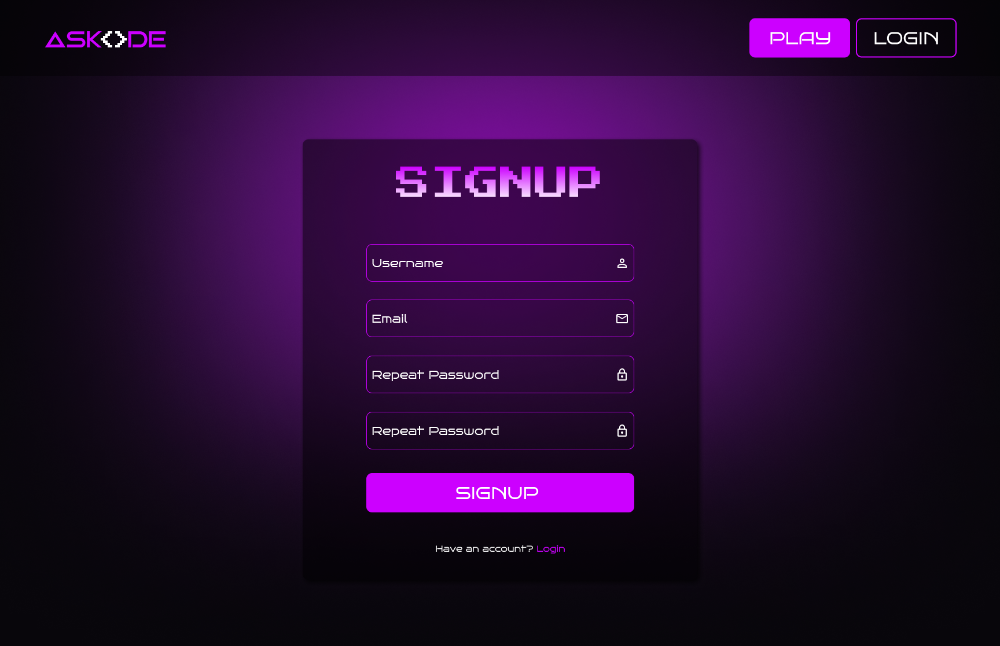
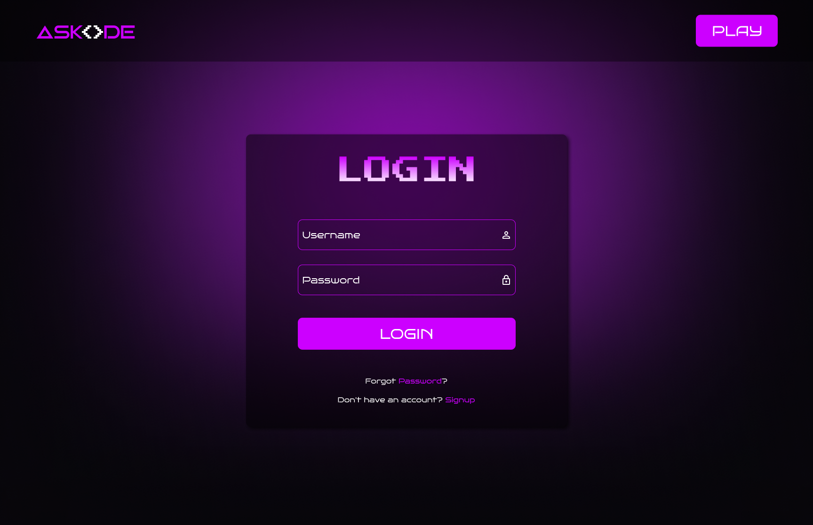
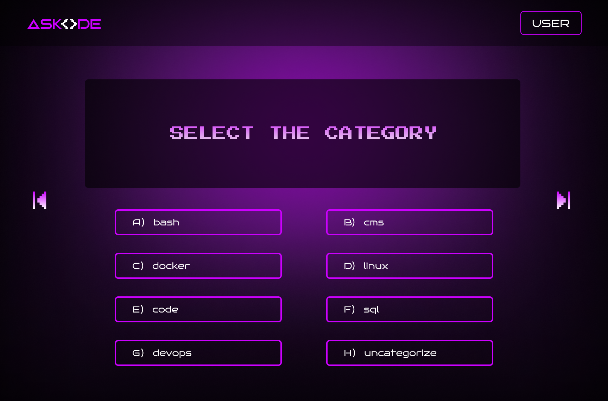

# AskCode

## 1. Presentación del Proyecto

**Askode** es una aplicación web que consume la **Quiz API** para proporcionar a los usuarios una serie de preguntas de opción múltiple. Estas preguntas son devueltas en un formato JSON, que luego es renderizado en la aplicación para que los usuarios puedan interactuar con él. A continuación se muestra un ejemplo del formato de la API:

```JSON
  {
    "id": 1,
    "question": "How to delete a directory in Linux?",
    "description": "delete folder",
    "answers": {
      "answer_a": "ls",
      "answer_b": "delete",
      "answer_c": "remove",
      "answer_d": "rmdir",
      "answer_e": null,
      "answer_f": null
    }, 
    "multiple_correct_answers": "false",
    "correct_answers": {
      "answer_a_correct": "false",
      "answer_b_correct": "false",
      "answer_c_correct": "false",
      "answer_d_correct": "true",
      "answer_e_correct": "false",
      "answer_f_correct": "false"
    },
    "explanation": "rmdir deletes an empty directory",
    "tip": null,
    "tags": [],
    "category": "linux",
    "difficulty": "Easy"
  }
```

## 1. Presentación del Proyecto
La aplicación permite a los usuarios responder preguntas y recibir retroalimentación instantánea sobre sus respuestas.

## 2. Autores
Somos un equipo de tres desarrolladores web que estamos realizando un curso de desarrollo frontend en CodeOp. Los integrantes del equipo son:
- Felix Rodriguez
- Isiah Zacarias
- Laura Lopez

## 3. Instalación
Para instalar y ejecutar el proyecto localmente, sigue estos pasos:
Clonar el repositorio:
bash
git clone https://github.com/creativesDevs/Duckgger.git
cd askcode

Instalar las dependencias:
Asegúrate de tener Node.js instalado en tu sistema.
bash
npm install

Ejecutar el servidor de desarrollo:
bash
npm run dev

## 4. Diagrama de User Flow
El siguiente diagrama de flujo representa la experiencia del usuario al interactuar con la aplicación:
css
[Inicio] --> [home] --> [singup]  --> [Login]  --> [Select Categories]
                                                           |
                                                           v 
                                               [Seleccionar Respuesta]        
                                                           |         
                                                           v         
                                             [Verificación de Respuesta]   
                                                           |
                                                           v
                                             [Siguiente Pregunta o Finalizar]

## 5. Diseño en Figma
El diseño de la aplicación fue creado utilizando Figma. 
 

<div style="display: flex; width: 100%; gap: 10px;">
  
  <div style="flex: 1;">
    
  </div>

  <div style="flex: 1; display: flex; flex-direction: column; gap: 50px;">
    
    
    
  </div>
</div>

Puedes visualizar el diseño en el siguiente enlace:
[Enlace al diseño de Figma](https://www.figma.com/design/vCcOTjJrNyCHJzGMxPzn1f/Duckbugger?node-id=0-1&t=rHOXxpnazOJFf2VW-1)

## 6. Agradecimientos
Queremos expresar nuestro agradecimiento a CodeOp por brindarnos las herramientas y el conocimiento necesario para desarrollar este proyecto. 


